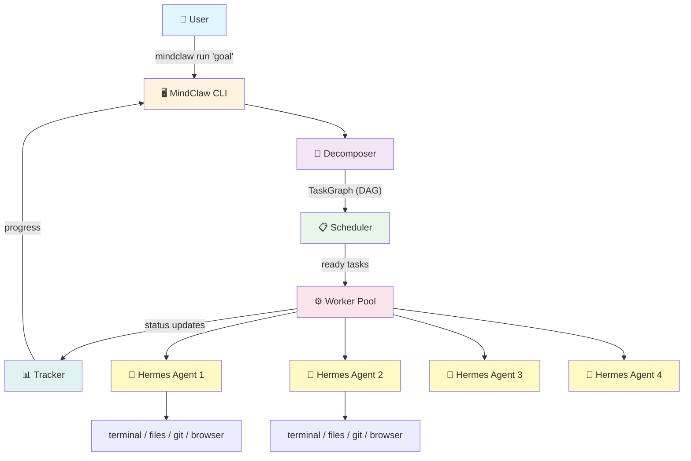
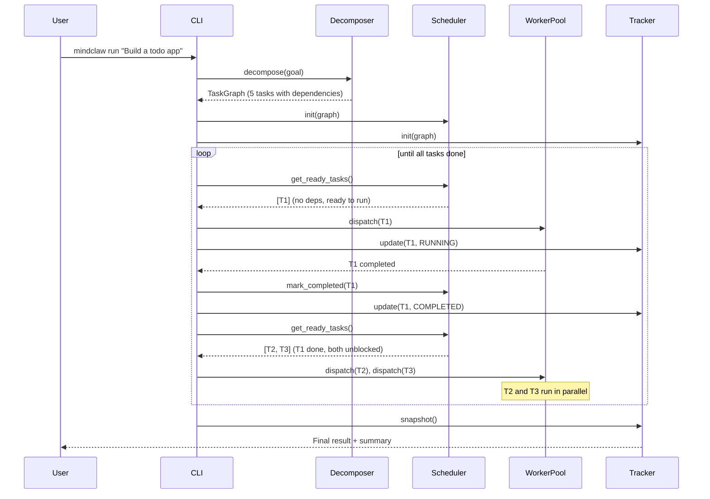
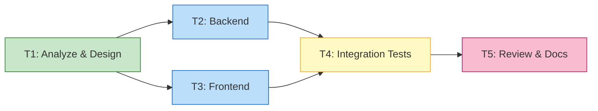
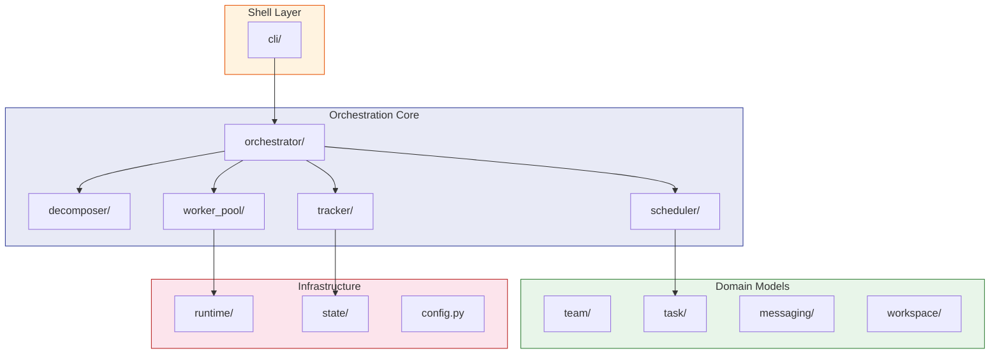

<div align="center">

# MindClaw

**Hermes is the most capable solo agent. MindClaw makes it a team.**

[](https://www.python.org/downloads/)
[](LICENSE)
[]()

[English](./README.md) | [简体中文](./README.zh-CN.md)

</div>

MindClaw is a multi-agent orchestration layer built on top of [Hermes Agent](https://github.com/NousResearch/hermes-agent). It takes Hermes' powerful single-agent runtime — 40+ tools, self-improving memory, any model provider — and adds structured team coordination: task decomposition, dependency scheduling, parallel execution, and real-time observability.

Inspired by the orchestration patterns of [ClawTeam](https://github.com/HKUDS/ClawTeam) and powered by the execution engine of [Hermes](https://github.com/NousResearch/hermes-agent).

> If this direction looks useful to you, consider giving the project a star to follow its development.

---

## The Problem

You're using Hermes for a complex project. You type your goal. The agent works for 30 minutes, the context window fills up, it loses track, starts going in circles.

You wish you could split the work across multiple agents — one doing backend, one doing frontend, one writing tests — but:

- Hermes' built-in `delegate_task` is **blocking** — the parent agent waits for all children to finish, you can't see intermediate progress
- It's **ephemeral** — if anything crashes, all state is lost
- It's **flat** — only parent-child relationships, no structured task graphs or team-level coordination

Other multi-agent frameworks (CrewAI, AutoGen) solve coordination but their agents are just LLM API wrappers — no terminal, no file system, no git, no real developer toolchain.

## The Solution

One command. A team of agents. Real-time progress.

```bash
mindclaw run "Build a REST API with auth, a React frontend, and integration tests"
```

```
🧠 Decomposing goal into tasks...
  ├── T1: Design API schema and data models
  ├── T2: Implement JWT authentication (depends on T1)
  ├── T3: Build CRUD endpoints (depends on T1)
  ├── T4: Create React frontend (depends on T1)
  └── T5: Write integration tests (depends on T2, T3, T4)

🚀 Phase: execute
  ┌─────────────┬──────────┬───────────┐
  │ Task        │ Agent    │ Status    │
  ├─────────────┼──────────┼───────────┤
  │ T1: Schema  │ worker-1 │ ✅ done    │
  │ T2: Auth    │ worker-2 │ 🔄 running │
  │ T3: CRUD    │ worker-3 │ 🔄 running │
  │ T4: React   │ worker-4 │ 🔄 running │
  │ T5: Tests   │ —        │ ⏳ blocked │
  └─────────────┴──────────┴───────────┘

==================================================
Goal: Build a REST API with auth, a React frontend, and integration tests
Status: completed
Tasks: 5/5 completed, 0 failed
Time: 10.6s
==================================================
```

---

## Architecture

### System Overview



### Pipeline Data Flow



### Task Dependency Graph (DAG)



> T2 and T3 have no dependency on each other — the scheduler detects this and runs them **in parallel** on separate workers.

### Module Architecture



### Key Design Decisions

- **Pipeline architecture** — each module (decomposer, scheduler, worker pool, tracker) is independent with clear interfaces. Replace any piece without touching the others.
- **Deep runtime integration** — workers are Hermes `AIAgent` objects instantiated via Python API, not black-box CLI processes. MindClaw controls model selection, toolsets, system prompts, and iteration budgets per worker.
- **Phase-driven orchestration** — inspired by ClawTeam's harness model: plan → execute → verify. Each phase has gate conditions that must pass before advancing.

---

## Quick Start

### Prerequisites

- Python 3.10+
- [uv](https://github.com/astral-sh/uv) (recommended) or pip

### Installation

```bash
# Clone the repository
git clone https://github.com/wanlixing-dream/MindClaw.git
cd MindClaw

# Create virtual environment and install (recommended)
uv venv .venv --python 3.12
source .venv/bin/activate
uv pip install -e ".[dev]"

# Or using pip
pip install -e ".[dev]"
```

### Verify Installation

```bash
# Check everything is working
mindclaw doctor

# See all available commands
mindclaw --help

# See current module layout
mindclaw modules
```

### Usage

#### Run a goal (full orchestration pipeline)

```bash
# Basic usage — decomposes goal, schedules tasks, runs workers
mindclaw run "Build a REST API with auth"

# Control parallelism
mindclaw run "Build a full-stack app" --workers 8
```

#### Manage teams and tasks

```bash
# Create a team
mindclaw team create my-team --goal "Build a web app" --leader alpha

# List teams
mindclaw team list

# Create a task manually
mindclaw task create "Implement login" --team my-team --priority high

# List tasks
mindclaw task list --team my-team
```

#### Inspect state

```bash
# See where local state is stored
mindclaw state where
```

---

## Why MindClaw

### hermes alone vs hermes + MindClaw

| | `hermes` alone | `hermes` + MindClaw |
|---|---|---|
| Complex tasks | One agent handles everything, context overflows | Auto-split into sub-tasks, each agent stays focused |
| Parallel execution | `delegate_task` blocks, parent agent idles | True parallel, non-blocking, real-time observable |
| Crash recovery | All state lost, start over | Task state persisted, resume from checkpoint |
| Progress visibility | Can't see what sub-agents are doing | Live task board + agent activity stream |
| Team coordination | Only parent-child relationship | Leader-worker structure, inter-agent messaging |
| Getting started | Already a Hermes user: zero cost | `pip install mindclaw` → `mindclaw run` |

### Why not just use X?

**"Why not Hermes' built-in `delegate_task`?"**
`delegate_task` is in-process, short-lived delegation — the parent blocks, no persistence, no observability. Good for simple sub-tasks. MindClaw is persistent team orchestration — task graphs, dependency scheduling, parallel execution, state recovery. Built for complex projects that need multiple agents collaborating over time.

**"Why not ClawTeam?"**
ClawTeam manages agents as black-box CLI processes via tmux. MindClaw integrates Hermes at the Python API level — it controls each worker's model, tools, context, and iteration budget. No tmux, no extra CLI dependencies.

**"Why not CrewAI / AutoGen?"**
Their agents can only call LLM APIs. Each MindClaw worker is a full Hermes agent — with terminal, file system, browser, memory, and skills. It doesn't simulate a developer's toolchain. It **is** the toolchain.

---

## Repository Structure

```text
MindClaw/
├── README.md
├── ROADMAP.md
├── pyproject.toml
├── docs/
│   ├── architecture.md                      # System architecture
│   └── superpowers/specs/                   # Design specs
├── mindclaw/
│   ├── cli/              # CLI commands (typer + rich)
│   ├── decomposer/       # Goal → TaskGraph (LLM or mock)
│   │   ├── interface.py          DecomposerBase ABC
│   │   └── mock_decomposer.py   Fixed graph for testing
│   ├── scheduler/         # DAG topological scheduling
│   │   ├── graph.py              TaskGraph, TaskNode, validation
│   │   └── engine.py             Scheduler (ready detection)
│   ├── worker_pool/       # Worker lifecycle management
│   │   ├── interface.py          WorkerBackend ABC
│   │   ├── mock_backend.py       Sleep-based mock
│   │   └── manager.py            WorkerPool (dispatch + poll)
│   ├── tracker/           # Real-time status + JSON persistence
│   ├── orchestrator/      # Pipeline controller (wires everything)
│   ├── team/              # Team and member models
│   ├── task/              # Task state and dependency models
│   ├── messaging/         # Inter-agent message models
│   ├── workspace/         # Workspace isolation models
│   ├── runtime/           # Runtime adapter interface
│   └── state/             # JSON-backed state store
└── tests/                 # 22 tests covering full pipeline
```

## Roadmap

| Phase | Status | Description |
|-------|--------|-------------|
| Phase 0 | ✅ Done | Repository foundation |
| Phase 1 | ✅ Done | Core domain models (team, task, messaging, workspace) |
| Phase 2 | 🔄 Active | Orchestration MVP — decomposer + scheduler + mock workers |
| Phase 3 | ⬜ Next | Hermes runtime integration — real `AIAgent` workers |
| Phase 4 | ⬜ Planned | Developer experience — templates, resume, Web UI |

See `ROADMAP.md` for the full phase breakdown.

## Documentation

- `docs/architecture.md` — system architecture
- `docs/superpowers/specs/` — design specifications
- `ROADMAP.md` — implementation phases

## Contributing

Contributions, feedback, architecture discussions, and experiments are welcome.

## License

MIT

## Acknowledgements

MindClaw is built on top of the [Hermes Agent](https://github.com/NousResearch/hermes-agent) runtime by Nous Research, and draws orchestration design inspiration from [ClawTeam](https://github.com/HKUDS/ClawTeam) by HKUDS.
